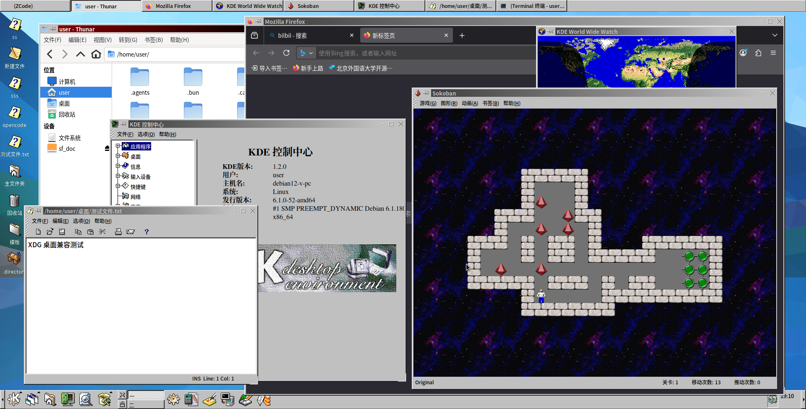

# KDE 1.1.2 Revival — 在 Debian 12 上复活 1999 年的桌面，并让它显示中文



把 KDE 1 系列的最终版本 **KDE 1.1.2**（1999 年 9 月 13 日发布）在 2026 年的 Debian 12 (bookworm) 上跑起来；在此基础上实施**路线乙（UTF-8 现代化补丁）**，使这个 27 年前的桌面在现代系统上流畅、稳定地运行完整的简体中文（zh-CN）环境。

**总体目标（验收标准，详见 `AGENTS.md` §1）：**

1. **流畅稳定运行**：UTF-8 系统上，zh_CN 的 KDE 1 桌面不崩溃、不乱码、不卡顿。
2. **现代输入法稳定接入**：fcitx5 与 fcitx 两代输入法框架均须稳定、完美运行（经 XIM 通道接入）。
3. **浏览器内核跟进**：kfm 以 **WebKit2GTK 为新内核**（Debian 12 官方包，完整现代 CSS/JIT JS/HTTPS，经 XEmbed 嵌入 kfm 窗口），与 1999 年原始渲染器构成新旧双内核可切换；CEF（Chromium）备选，Firefox/Gecko 无嵌入接口已排除。
4. **全面中文化与英文对齐**：菜单、帮助、提示等所有界面内容全面中文化，覆盖率与英文原文对齐；kvt 终端内中文内容显示正常、可与现代应用双向复制粘贴中文；翻译禁止自造译法，须上网核实通行译法并与当今 KDE 6 的 zh_CN 官方术语一致（1999 年旧 GB2312 翻译仅作底稿）。
5. **Debian 软件包交付（唯一正式安装方式）**：正式安装只经 deb 包（dpkg / apt）——源码包（sdeb）与二进制 `.deb` 包分目录存放（`dist/src/` 与 `dist/deb/`）；.deb 自包含全部系统集成件（xsessions 会话入口、TQt3 运行库等）；`build.sh` 仅做开发期构建与 `./staging` 暂存运行验证，不 sudo 安装到系统。
6. **现代系统集成**：图形登录由系统显示管理器（lightdm）管理——会话菜单可选 KDE 1 直接登录，不依赖手工 startx（方式与 XFCE 等现代桌面一致）；事件音效接入现代音频栈（PipeWire/PulseAudio）正常发声；XDG 用户目录与宿主桌面共用（桌面/模板经 user-dirs.dirs，回收站对齐 freedesktop 标准）。
7. **打印接入 CUPS**：Qt1 的 lpr 打印路径经 cups-bsd 兼容层接入现代 CUPS，实测任务进队列。
8. **全面 UTF-8 融合**：多字节感知不止于编辑部件，而是所有模块全面的接入、融合——Qt 内核与各 KDE 模块中一切按字节处理文本的路径（光标、选区、截断、字符计数、宽度测量、列宽、文件名/标题显示等）一律按 UTF-8 字符边界精确操作；KDE 1 作为整体完美运行于 UTF-8 系统，用户在任何文本交互处感知不到这是单字节时代的程序。

## 代码来历

本仓库的代码是历史遗产的延续，不是重新实现：

- **上游源头**：KDE 团队 1999 年发布的 KDE 1.1.2（KDE 1 系列最后一版）。
- **GUI 底座（2026-08 起为 TQt3）**：Trinity Desktop Project 维护的 Qt3 分支 **TQt3**，
  本仓库快照为 **r14.1.6**（commit 3a07835，2026-04-11）。
  - **git 地址**：`https://mirror.git.trinitydesktop.org/gitea/TDE/tqt3`（分支/tag 形如 `r14.1.6`）
  - **许可证**：GPLv2 / GPLv3 / QPL 三选一，本项目选择 **GPLv2** 侧（与 KDE 模块许可兼容；QPL 与 GPL 不兼容故排除）。相比 Qt1 的专有「Qt Free Edition License」（修改分发无纸面授权），TQt3 彻底解决合规问题。
  - **更新方式**：`tqt3/` 是 pristine 快照、绝不直接修改；要升级时从上述地址拉取新 tag 替换 `tqt3/`，重跑 `port/gen_q1compat.sh` 与 `port/gen_fwheaders.sh`，删 `tqt3-build/` 重建；若上游变更导致编译失败，在 `tqt3-patches/` 新增补丁（构建时打入，按文件名序）。
- **KDE 源码直接来源**：GitHub 用户 NishiOwO 的 [kde1 元仓库](https://github.com/NishiOwO/kde1)（其上游为 KDE 官方历史仓库 KDE/kde1-kdelibs、KDE/kde1-kdebase 等；历史源码 + CMake 现代适配）。取回时间：2026 年 8 月。
- 2026-08 起本仓库脱离上游，移除原 git 历史与子模块结构，整合为普通目录树；同月底完成底座更换 Qt1→TQt3，git 历史已重写彻底清除 qt1（见 `CHANGELOG.md`）。

## 新增修改由 AI 编写

除上述历史源码外，本仓库的全部**新增修改**（构建调整、项目文档、路线乙中文渲染补丁等）由 **GLM-5.3**（智谱 Z.ai 的大语言模型，以 ZCode 编码代理运行）编写，由项目维护者审核入库。新增修改不改变原始文件的版权归属，并按原文件许可发布。

## 版权与维护者

| 部分 | 版权 | 许可 |
|---|---|---|
| `tqt3/` | © Trolltech ASA / Trinity Desktop Project | **GPLv2**（三选一许可证之 GPLv2 侧，见 `tqt3/LICENSE.GPL2`） |
| `tqt3-patches/` | 本项目 | GPLv2（跟随 tqt3） |
| `port/` 脚手架 | 本项目 | 公有领域（CC0 精神，可自由复用） |
| `kdelibs/` 等 KDE 模块 | © KDE 团队 | GPL / LGPL，见各模块 `COPYING`、`COPYING.LIB` |
| 本仓库的新增修改 | 维护者持有 | 遵循所修改文件的原始许可 |

原始版权声明与许可文件全部原样保留；对源码的修改在文件头部追加维护者标注（模板见 `AGENTS.md` 工作约定第 3 条）。

- 维护者：`<维护者姓名> <邮箱>`（待填）
- 修改作者：GLM-5.3 (Z.ai)

## 中文支持：源码考证结论与本项目方案

**历史考证（1999 年原始形态）：**

- KDE 自带 `zh_CN.GB2312` / `zh_TW.Big5` 界面翻译（1999 年王建等翻译，覆盖不全）。
- KCharset 字符集体系无任何 CJK 编码；Qt 1.44 渲染内核为纯单字节路径——汉字无法上屏，是当年根本瓶颈。

**本项目做法（2026-08 起以 TQt3 为底座）：**

宿主系统保持 UTF-8 不动；GUI 底座为 **TQt3**（原生 Unicode：TQString 内部 UTF-16、fontconfig/Xft 抗锯齿渲染、原生 XIM 与 UTF8_STRING 剪贴板支持——**与当今 KDE/XFCE 同一套字体管理与显示**，直接使用现代 TTF/OTF 中文字体）。KDE1 六模块经 `port/` **迁移脚手架**（strangler fig 模式）完成编译迁移：`TQTextCodec::setCodecForCStrings(UTF-8)` 全局开关统一字符串编码语义，例外点（system() 参数/环境变量/QFile 字节流/X11 属性/协议字节）按 Qt1 路线勘定的语义地图逐点复审。po 翻译文件 UTF-8 化并持续补译（对齐 KDE6 术语）；XIM 输入接入 fcitx5 / fcitx。脚手架随模块显式 TQ 化逐步摘除，终态整体拆除——不留在最终架构里。

## 构建与运行（Debian 12 bookworm）

```bash
# 依赖——构建必需（libglu 为 tqt3 OpenGL 扩展；
# libssl 为 kdebase 所需；pkg-config 为各模块 CMake 探测所需；
# libxft/libfontconfig/libfreetype 为 TQt3 fontconfig+Xft 字体栈；
# libwebkit2gtk 为 kfm 新内核）
sudo apt install build-essential cmake git pkg-config \
     libx11-dev libxext-dev libxmu-dev libxpm-dev libjpeg-dev libpng-dev \
     zlib1g-dev libtiff-dev libssl-dev libglu1-mesa-dev \
     libxft-dev libfontconfig1-dev libfreetype-dev libwebkit2gtk-4.1-dev

# 依赖——运行与测试推荐（中文字体/输入法、padsp 音效转发、无头验证工具）
sudo apt install fonts-noto-cjk fcitx5 fcitx5-chinese-addons \
     fcitx pulseaudio-utils \
     xvfb gettext x11-utils x11-xserver-utils imagemagick xdotool \
     xterm dbus-x11

./build.sh --prefix=/usr/kde1
```

构建顺序：tqt3 → kdelibs → kdebase → kdegames / kdegraphics / kdeutils / kdenetwork / kdetoys（脚本自动完成）。`build.sh` 只做编译，并把安装结果经 DESTDIR 重定向到仓库内 `./staging` 暂存区——零提权、不写入任何系统目录；需要干净重建时，先执行 `./clean.sh` 清理各模块构建产物（`build/` 目录）与暂存区，再重新运行 `./build.sh`。

开发期运行（不安装，直接从暂存区起；`~/.xinitrc` 末行 `exec startkde` 后执行 `startx`）：

```sh
export PATH=<仓库>/staging/usr/kde1/bin:$PATH
export LD_LIBRARY_PATH=<仓库>/staging/usr/kde1/lib
export KDEDIR=<仓库>/staging/usr/kde1
```

正式安装**只通过 deb 包**：安装 `dist/deb/` 下的 `.deb`（dpkg -i / apt install）后，在系统显示管理器（lightdm）的会话菜单选择 KDE 1 直接登录（见总体目标第 5、6 条）。

KDE 1 安装于独立前缀，与本机 Qt5 / Qt6 应用互不干扰。

打包交付：项目最终以标准 Debian 软件包形式发布——源码包（sdeb）存于 `dist/src/`，二进制 `.deb` 包存于 `dist/deb/`，分目录存放。deb **开箱即用、零手工配置**：内置 lightdm 会话入口（`/usr/share/xsessions/kde1.desktop`）与 startkde 环境包装脚本（PATH / LD_LIBRARY_PATH / KDEDIR 自动设置），`apt install` 后在 lightdm 会话菜单选择 KDE 1 即可登录，无需手工 `.xinitrc` 或环境变量；`apt remove` 干净移除。按模块拆分核心包与可选应用包。

BSD 备注（继承自上游）：FreeBSD 需创建 `/usr/local/libdata/ldconfig/kde1`（内容为 `/usr/kde1/lib`）并重启 ldconfig，且需加载 `pty` 模块才能使用终端。

## 文档约定

- 本项目**不在任何 md 文档里写日志式记录**；修改历史统一且仅记录于 `CHANGELOG.md`，其余文档只保留当前最终状态。
- AI 代理与协作者的工作章程见 `AGENTS.md`。
